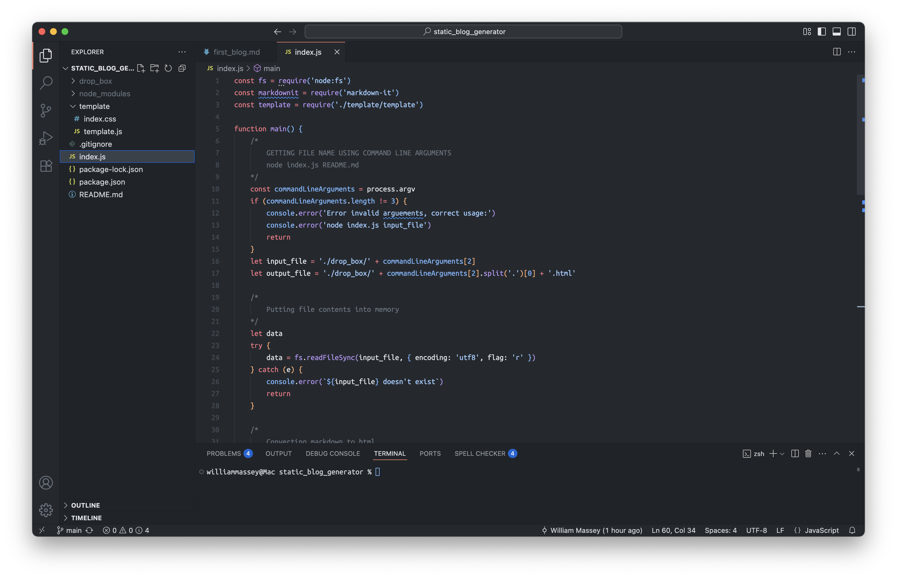

# How I Built This Very Own Blog Site
Welcome to my blog! You're currently reading a post on a site that I built from the ground up, not with a pre-made platform like WordPress, but with a custom "static site generator" that I've hacked together myself. This journey is a dive into more complex topics for me, like compiler design and the structure of HTML, and I'm excited to share the story.

## The Grand Vision: Markdown to HTML (and a Compiler!)
The initial spark for this blog actually came from a much larger, more ambitious project: building my own Markdown to HTML converter, with the ultimate goal of understanding and creating a compiler. I wanted to understand the intricate process of taking human-readable text (like the Markdown I'm writing this in) and transforming it into the structured HTML that web browsers understand.

I quickly learned that building a robust Markdown parser and converter from scratch is, well, *a little more difficult than I had planned!* It's a complex task involving lexical analysis, parsing, and rendering. Despite the challenges, I'm still incredibly keen to continue working on that project. You can follow its progress and check out the code (which is semi-working!) on my GitHub:
[WilliamM163/markdown_to_html](https://github.com/WilliamM163/markdown_to_html)

Here's a little screenshot of some of the code that I worked on:

## The Practical Solution: A Little Help from npm
While my custom Markdown converter is still a work in progress, I wanted a functional blog *now*. So, I pivoted to a more pragmatic solution for the immediate term. I found an excellent existing npm package that handles the Markdown to HTML conversion beautifully. This allowed me to bypass the complex parsing stage for the time being and focus on the overall structure of the blog.

## Hacking Together the Static Site Generator
With the Markdown conversion handled, the next step was to stitch together a system that could take my Markdown files, convert them to HTML, and then output a complete, stylable static website. This is where my "static site generator" comes into play.

Essentially, I've created a process that:
1.  Reads Markdown files (like this one).
2.  Uses the npm package to convert the Markdown content into HTML snippets.
3.  Takes these HTML snippets and embeds them into pre-defined HTML template.
4.  Applies custom CSS styling to make everything look cohesive and, hopefully, appealing!

It's been a fun challenge to connect these pieces, and it truly gives me more control over the final output. The entire codebase for this static site generator is also open-source and available on my GitHub:
[WilliamM163/static_site_generator](https://github.com/WilliamM163/static_site_generator)

## Styling with CSS
Finally, to bring the blog to life visually, I've used standard CSS. This allows me to define the fonts, colors, layouts, and responsiveness, ensuring a consistent and pleasant reading experience across different devices.

---
This blog is a testament to learning by doing, embracing challenges, and leveraging existing tools when necessary to achieve a goal. I'm excited to share more of my thoughts and projects here. Thanks for reading!